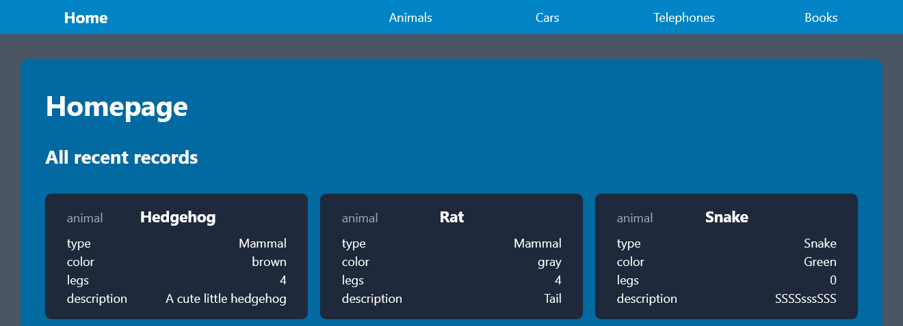
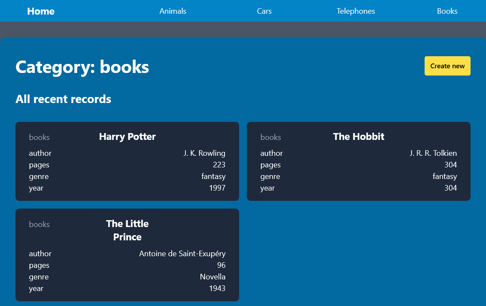
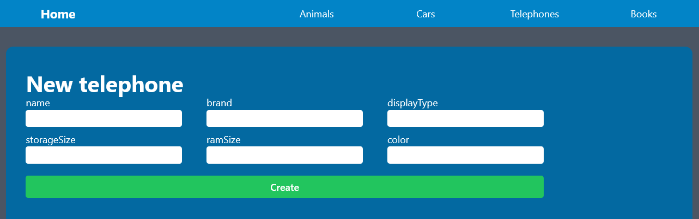
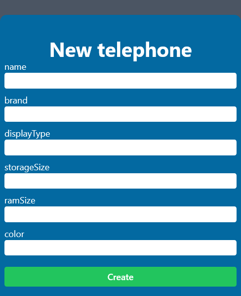
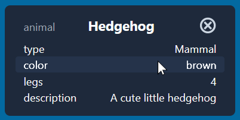
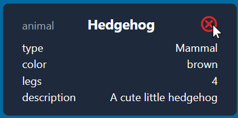

# Final maturita exam project

- Fully responsive design
- Ability to create, read and delete data

### Task

- Create HTTP server that connects to DB
- Have 4 endpoints for: animals, cars, telephones, books
  - animals - route: `/step`
  - cars - route: `/srac`
  - telephones - route: `/senohp`
  - books - route: `/skooby`
- For each category create page, where will be displayed all records from that category
- On homepage show redirects to category pages
- Have button to delete record
- Have page for creating records for each category

### Category page

<table>
<tr>
<th> Destop </th>
<th> Mobile </th>
</tr>
<tr>
<td>



</td>
<td>


</td>
</tr>
</table>

### Create item page

<table>
<tr>
<th> Destop </th>
<th> Mobile </th>
</tr>
<tr>
<td>



</td>
<td>



</td>
</tr>
</table>

### Hover effects

<table>
<tr>
<th> Item select </th>
<th> Delete card </th>
</tr>
<tr>
<td>



</td>
<td>



</td>
</tr>
</table>


## Installation

- Clone repository 
```
git clone https://github.com/RadekPelikan/BookCRUD.git
cd bookCRUD
```
- Open 2 terminals
- In one terminal: `cd backend`
- Create `.env` file in [backend directory](./backend/)
```python
# Example of url:
# mongodb+srv://<DB_USER>:<DB_PASSWORD>@<DB_NAME>.mongodb.net/?retryWrites=true&w=majority
DB_PASSWORD=password    # Database password
DB_USER=admin           # Database user
DB_NAME=cluster0.dopig  # Database cluser name
# PORT is optional
PORT=3030               # PORT which the backend runs on
```
- Install packages and run server
```
npm i
npm run dev
```
- In second terminal: `cd client`
- Install packages and run vite server
```
npm i
npm run dev
```
- The vite server runs on port `3001` by default
- This could be changed in [vite.config.ts file](./client/vite.config.ts) on line 9: `port: <new port>,`

## Technologies

- nodejs, npm
- JS, TS
- React, Vitejs
- Express
- MongoDB, mongoose
- React icons
- TailwindCSS
- nodemon